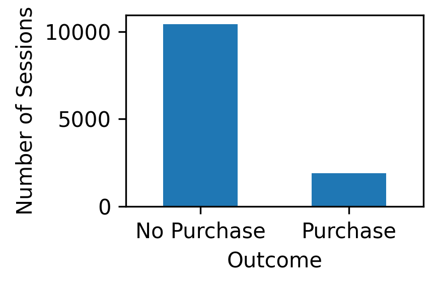
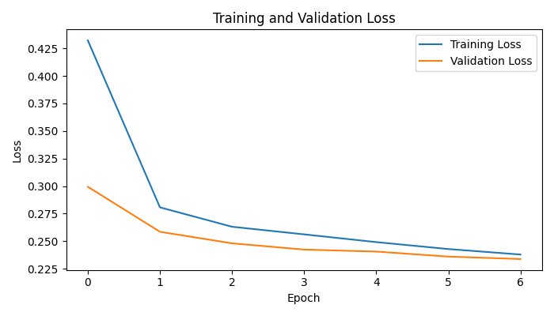
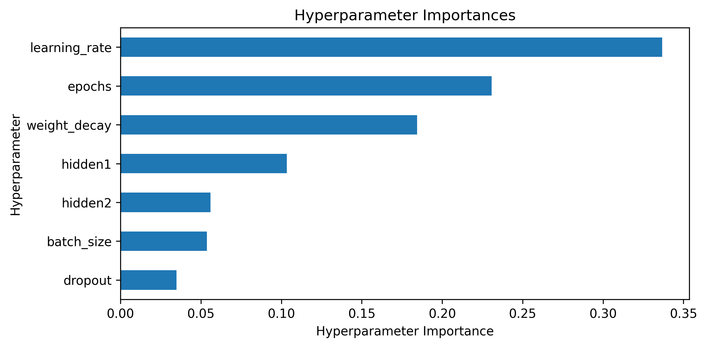
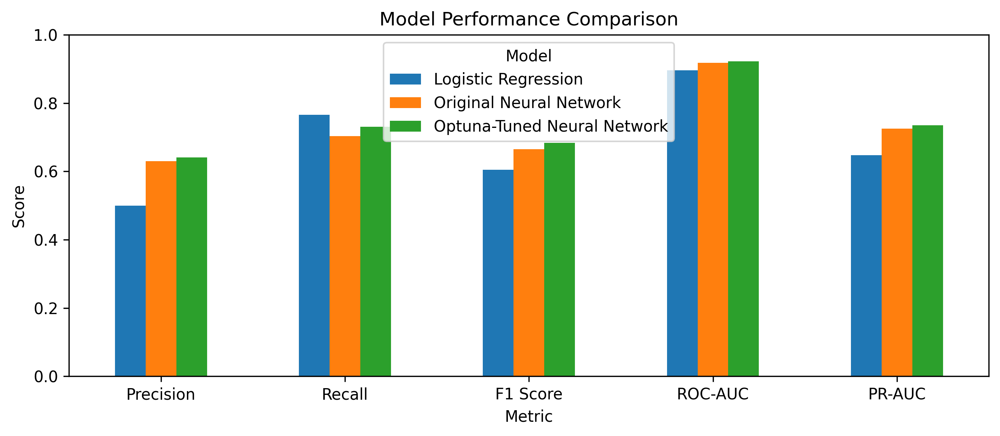

# Online Purchase Prediction Using PyTorch Neural Networks

A machine-learning project that predicts whether an online shopping session will result in a purchase using PyTorch neural networks, validation-based model selection, and Optuna hyperparameter optimization.

## Project Overview

The goal of this project is to develop a binary classification model that identifies online shopping sessions that are likely to result in a purchase.

The project demonstrates an end-to-end machine-learning workflow including:

* Exploratory data analysis
* Stratified train/validation/test splitting
* Numerical feature scaling
* Categorical feature encoding
* PyTorch tensor and DataLoader creation
* Neural-network development and training
* Validation-based overfitting analysis
* Classification-threshold optimization
* Hyperparameter tuning with Optuna
* Comparison with a Logistic Regression baseline
* Final evaluation on an untouched test set

Three models are compared:

1. **Logistic Regression** — baseline model
2. **Original Neural Network** — manually specified architecture and hyperparameters
3. **Optuna-Tuned Neural Network** — neural network with jointly optimized hyperparameters

---

## Dataset

The project uses the **Online Shoppers Purchasing Intention Dataset** from the UCI Machine Learning Repository.

The dataset contains:

* **12,330 online shopping sessions**
* **17 predictive features**
* Binary target variable: `Revenue`
* Approximately **15.5% positive purchase sessions**

This class imbalance makes metrics such as precision, recall, F1 score, ROC-AUC, and PR-AUC particularly useful for evaluating model performance.



Dataset reference:

Sakar, C. & Kastro, Y. (2018). *Online Shoppers Purchasing Intention Dataset*. UCI Machine Learning Repository.
https://doi.org/10.24432/C5F88Q

---

## Data Preparation

The dataset is divided into:

* **70% training data**
* **15% validation data**
* **15% test data**

Stratified sampling is used to maintain approximately the same purchase rate in each subset.

Numerical features are standardized using `StandardScaler`, while categorical features are transformed using one-hot encoding.

To prevent data leakage, the preprocessing pipeline is **fitted only on the training data** and then applied to the validation and test sets.

---

## Original Neural Network

The original PyTorch model uses the following architecture:

```text
Input Features
      ↓
64 Neurons
      ↓
ReLU
      ↓
Dropout (0.20)
      ↓
32 Neurons
      ↓
ReLU
      ↓
1 Output Logit
```

The model is trained using:

* `BCEWithLogitsLoss`
* Adam optimizer
* Learning rate: `0.001`
* Batch size: `64`

Validation loss was used to examine overfitting. With the original hyperparameter configuration, approximately **7 epochs** provided an appropriate balance between learning and generalization.



### Classification Threshold

Instead of automatically using a classification threshold of 0.50, several thresholds from 0.10 to 0.90 were evaluated on the validation set.

The threshold maximizing validation F1 was selected.

**Original Neural Network threshold: 0.35**

---

## Hyperparameter Optimization with Optuna

Optuna was used to jointly optimize several neural-network hyperparameters.

The search included:

| Hyperparameter      | Search Space |
| ------------------- | ------------ |
| First hidden layer  | 32, 64, 128  |
| Second hidden layer | 16, 32, 64   |
| Dropout             | 0.0–0.5      |
| Learning rate       | 0.0001–0.005 |
| Batch size          | 32, 64, 128  |
| Epochs              | 5–20         |
| Weight decay        | 1e-6–1e-2    |

The optimization objective was to **maximize validation F1 score**, and 30 Optuna trials were performed using the TPE sampler.

### Best Hyperparameters

The best Optuna trial achieved a validation F1 score of **0.684**.

| Hyperparameter           | Best Value |
| ------------------------ | ---------: |
| First hidden layer       |         64 |
| Second hidden layer      |         64 |
| Dropout                  |       0.30 |
| Learning rate            |    0.00193 |
| Batch size               |         64 |
| Epochs                   |         12 |
| Weight decay             |    0.00115 |
| Classification threshold |       0.30 |

The tuned architecture is therefore:

```text
Input Features
      ↓
64 Neurons
      ↓
ReLU
      ↓
Dropout (0.30)
      ↓
64 Neurons
      ↓
ReLU
      ↓
1 Output Logit
```

The tuned model selected **12 epochs**, whereas the earlier standalone analysis suggested 7 epochs for the original model. This difference occurs because the original analysis examined the number of epochs while the other hyperparameters remained fixed. Optuna instead optimized epochs jointly with architecture, dropout, learning rate, batch size, and weight decay.

The hyperparameter-importance analysis also showed that **learning rate had the largest influence on optimization performance**, followed by the number of epochs and weight decay.



---

## Final Model Comparison

After all model development, hyperparameter selection, and threshold selection were completed using only the training and validation sets, the three models were evaluated on the held-out test set.

| Model                           |  Accuracy | Precision |    Recall |  F1 Score |   ROC-AUC |    PR-AUC |
| ------------------------------- | --------: | --------: | --------: | --------: | --------: | --------: |
| Logistic Regression             |     0.845 |     0.500 | **0.766** |     0.605 |     0.896 |     0.648 |
| Original Neural Network         |     0.890 |     0.630 |     0.703 |     0.664 |     0.917 |     0.725 |
| **Optuna-Tuned Neural Network** | **0.895** | **0.641** |     0.731 | **0.683** | **0.923** | **0.735** |



### Key Findings

The original neural network outperformed the Logistic Regression baseline on F1 score, ROC-AUC, and PR-AUC.

Hyperparameter optimization further improved the neural network:

* F1 score increased from **0.664 to 0.683**
* ROC-AUC increased from **0.917 to 0.923**
* PR-AUC increased from **0.725 to 0.735**
* Recall increased from **0.703 to 0.731**
* Accuracy increased from **0.890 to 0.895**

Although Logistic Regression achieved the highest recall, it produced substantially lower precision and F1. The **Optuna-tuned neural network provided the strongest overall balance between identifying purchase sessions and limiting false-positive predictions**.

---

## Technologies

* Python
* PyTorch
* Optuna
* pandas
* NumPy
* scikit-learn
* Matplotlib
* Jupyter Notebook

---

## Repository Structure

```text
Online-Purchase-Prediction/
│
├── Online Purchase Prediction Using PyTorch Neural Networks.ipynb
├── online_shoppers_intention.csv
├── purchase_distribution.png
├── training_validation_loss.png
├── model_performance_comparison.png
├── hyperparameter_importances.png
├── README.md
└── .gitignore
```

---


## Author

**Saman Teymoorianmotlagh**
